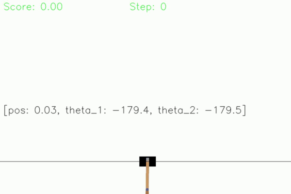

# Project: CartPole (Inverted Double Pendulumn) with Deep Q-Learning

Welcome to the CartPole (Inverted Double Pendulumn) reinforcement learning project! In this assignment, you’ll explore the fundamentals of Deep Q-Networks (DQN) by training an agent to balance a pole on a cart. Your goal is to understand how the DQN algorithm works, experiment with different settings, design your own reward function, and analyze the agent’s performance over time.



## Project Structure

- **main_dqn.py**  
  This is the main script for running the DQN algorithm. It trains the agent and saves the model parameters along with training graphs in the `results` folder every 100 epochs. Make sure to review this script carefully and try tweaking the hyperparameters to see how they impact the agent’s learning!  

- **dqn_utils.py**  
  This file contains the core components of the DQN, such as the network architecture and the Replay Memory class. 

- **visualise_performance.py**  
  This file reads the saved model parameters from the `results` folder and generates a video that demonstrates how well your agent balances the pole. 

## How to Get Started

1. **Design and train the Model**  
   Start by running the `main_dqn.py` script. This will train the DQN agent in the CartPole environment (this uses the DQN from `dqn_utils.py`, so you may need to design your own DQN model). The script will automatically save training results (model weights and graphs) in the `results` folder.
   ```bash
   python main_dqn.py
   ```

2. **Reward Function Design**  
   Open the `main_dqn.py` script and locate the `RewardWrapper` class. Modify the `step()` method inside this class to design your custom reward function. Your goal is to guide the agent to balance the pole longer and stabilise it more efficiently. Be creative and experiment with different reward structures!

3. **Analyze and Improve**  
   Once you have some training results, analyze the `results` folder to see how your agent is performing. Try modifying different parts of the `main_dqn.py` script, such as learning rate, batch size, or reward function, and see if you can improve the results.

4. **Visualise the Performance**  
   After you’ve trained your model, use the `visualise_performance.py` script to create a video that shows the agent’s performance.
   ```bash
   python visualise_performance.py
   ```


## Remark

You may need to execute the following:
```bash
pip install --upgrade -r requirements.txt